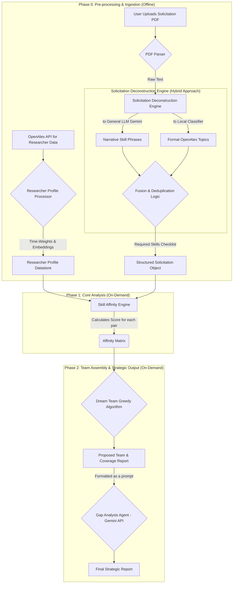

# The "Dream Team" Engine: An AI-Powered Grant Proposal Suitability Analyzer

## 1. Project Goal

The primary objective of this system is to analyze a given grant solicitation (provided as a PDF document) and identify an optimal "Dream Team" of 2-4 researchers from a predefined talent pool. The team selection is based on the complementary, time-weighted expertise of the researchers. The final output is a strategic gap analysis that details the proposed team's collective strengths and weaknesses relative to the specific funding opportunity, transforming raw data into actionable proposal strategy.

## 2. Core Features

- **Automated Solicitation Analysis**: Ingests any grant solicitation in PDF format and deconstructs it into its core requirements.

- **Hybrid Skill Extraction**: Utilizes a dual-pronged approach for maximum accuracy:
  - A general-purpose LLM (Gemini) identifies high-level narrative goals.
  - A specialized transformers model (OpenAlex/bert-base-multilingual-cased-finetuned-openalex-topic-classification-title-abstract) grounds the requirements in a formal academic ontology.

- **Time-Weighted Expertise**: Researcher profiles are built from OpenAlex data, with a recency-weighting algorithm that gives higher preference to newer, more relevant publications.

- **Semantic Affinity Scoring**: Moves beyond simple keyword matching to calculate a nuanced SkillAffinityScore based on the conceptual similarity between a researcher's work and a required skill.

- **Algorithmic Team Assembly**: Employs a greedy algorithm to analyze a comprehensive Affinity Matrix and propose a "Dream Team" with the best complementary skills to cover all solicitation requirements.

- **AI-Powered Gap Analysis**: Feeds the data-driven team recommendation into the Gemini API to generate a final strategic report, outlining strengths, weaknesses, and proposal strategies.

## 3. System Architecture

The system is designed in three distinct phases to ensure efficiency and scalability. The heavy computational work is done offline, ensuring a fast on-demand analysis for the user.

## 4. Mathematical & Technical Foundation

The engine's core is the Skill Affinity Score, a time-weighted semantic similarity calculation. For a given researcher (R) and a single required skill (Sk), the score is calculated as:

$$
\text{SkillAffinityScore}(R, Sk) = \max_{p \in P_R} \left( \frac{v_p \cdot v_{Sk}}{||v_p|| \cdot ||v_{Sk}||} \times W_t(p) \right) \times 100
$$

Where:
- $v_p$ and $v_{Sk}$ are the conceptual vectors for a researcher's paper and a required skill, respectively.
- The fraction represents the Cosine Similarity between the two vectors.
- $W_t(p)$ is the pre-calculated Recency Weight of the paper, ensuring current expertise is prioritized.
- $\max_{p \in P_R}$ ensures the researcher is judged on their single most relevant piece of work for that skill.

### Core Technologies Used:
- **Backend**: Python
- **Data Handling**: Pandas, NumPy
- **Vector Embeddings**: sentence-transformers library (all-MiniLM-L6-v2 model)
- **Topic Classification**: transformers library (OpenAlex/bert-base-multilingual-cased-finetuned-openalex-topic-classification-title-abstract model)
- **AI Strategy**: Google's Gemini API
- **Environment**: Google Colaboratory

## 5. How to Use

The system is designed to be run interactively within a Google Colab notebook.

1. **Setup**: Ensure your `works.csv`, `topics.csv`, and `awards.csv` (or equivalent DataFrames) are loaded into the environment.

2. **Configure API Key**: Add your Gemini API key to the Colab Secrets Manager with the name `GEMINI_API_KEY`.

3. **Run Pre-computation**: Execute the initial cells to build the Researcher Profile Datastore. This involves embedding all researcher publications and only needs to be done once per session.

4. **Upload Solicitation**: Use the file upload interface to provide a new grant solicitation in PDF format. The system will automatically parse it and generate the "Required Skills Checklist".

5. **Run Analysis**: The system will generate the Affinity Matrix, run the Dream Team algorithm, and produce the final strategic report powered by the Gap Analysis Agent.
