# AI-Powered Research Team Matching & Assembly System

[](https://www.python.org/downloads/)
[](https://streamlit.io/)
[](https://opensource.org/licenses/MIT)

> **Transform research solicitations into optimal research teams using AI-powered matching and assembly algorithms.**

An intelligent Streamlit application that analyzes research funding opportunities, matches researchers based on expertise and skills, and assembles optimal research teams using advanced machine learning techniques.

## 🚀 Quick Start

### Prerequisites
- Python 3.11 or higher
- [uv](https://docs.astral.sh/uv/) package manager (recommended) or pip

### Installation

1. **Clone the repository**
   ```bash
   git clone <repository-url>
   cd NSF-Grant-Applier
   ```

2. **Install dependencies**
   ```bash
   # Using uv (recommended)
   uv sync
   
   # Or using pip
   pip install -r requirements.txt
   ```

3. **Set up environment variables** (optional)
   ```bash
   cp .env.example .env
   # Edit .env and add your GROQ_API_KEY for enhanced AI analysis
   ```

4. **Launch the application**
   ```bash
   streamlit run app.py
   ```

5. **Access the application**
   Open your browser to `http://localhost:8501`

## 📋 Table of Contents

- [Features](#-features)
- [System Architecture](#-system-architecture)
- [Core Components](#-core-components)
- [Data Flow](#-data-flow)
- [Usage Guide](#-usage-guide)
- [Configuration](#-configuration)
- [Testing](#-testing)
- [Development](#-development)
- [Deployment](#-deployment)
- [Contributing](#-contributing)
- [License](#-license)

## ✨ Features

### 🎯 Core Capabilities
- **Intelligent Document Parsing**: Automatically extracts requirements from NSF, NIH, and generic RFP documents
- **Advanced Skill Extraction**: Dual-model approach using LLM and OpenAlex for comprehensive skill identification
- **Researcher Matching**: Hybrid TF-IDF and semantic similarity scoring for precise researcher-solicitation alignment
- **Team Optimization**: Algorithmic team assembly maximizing skill coverage and collaboration potential
- **AI-Powered Analysis**: Strategic insights and recommendations using Groq API integration

### 🔧 Technical Features
- **Multi-format Support**: PDF, TXT, and DOCX document processing
- **Performance Optimization**: Streamlit caching for sub-second response times
- **Graceful Degradation**: Fallback mechanisms when optional services are unavailable
- **Quality Assessment**: Confidence scoring and validation for extraction accuracy
- **Template System**: Save and reuse extraction patterns for different document types

### 📊 Analytics & Reporting
- **Comprehensive Reports**: Detailed team composition analysis with evidence backing
- **Performance Metrics**: Processing time, confidence scores, and quality indicators
- **Interactive Visualizations**: Skill coverage matrices and researcher affinity maps
- **Export Capabilities**: Markdown reports and structured data export

## 🏗️ System Architecture

```mermaid
graph TB
    A[Streamlit UI] --> B[Document Upload]
    B --> C[Solicitation Parser]
    C --> D[Enhanced Skill Extractor]
    D --> E[Data Loader]
    E --> F[Researcher Matcher]
    F --> G[Team Builder]
    G --> H[Report Generator]
    H --> I[AI Analysis]
    I --> J[Final Report]
    
    subgraph "Data Layer"
        K[TF-IDF Models]
        L[Researcher Vectors]
        M[Conceptual Profiles]
        N[Evidence Index]
    end
    
    E --> K
    E --> L
    E --> M
    E --> N
```



### Design Principles
- **Modular Architecture**: Single-responsibility components with clear interfaces
- **Stateless Services**: Utility classes with no persistent state between calls
- **Caching Strategy**: Aggressive caching to prevent expensive recomputation
- **Error Resilience**: Comprehensive error handling with user-friendly messages

## 🧩 Core Components

### 📄 Document Processing
- **`modules/solicitation_parser.py`**: Multi-format document parsing with pattern recognition
- **`modules/enhanced_skill_extractor.py`**: Dual-model skill extraction using LLM and OpenAlex

### 🔍 Matching Engine
- **`modules/matcher.py`**: Researcher scoring using hybrid TF-IDF and semantic similarity
- **`modules/team_builder.py`**: Team optimization using affinity matrices and coverage algorithms

### 📊 Data Management
- **`modules/data_loader.py`**: Efficient loading and caching of large datasets and ML models
- **`modules/data_models.py`**: Centralized type definitions and data structures

### 📈 Analysis & Reporting
- **`modules/report_generator.py`**: Comprehensive report generation with AI-powered insights

### 🎨 User Interface
- **`app.py`**: Streamlit application orchestrating the complete workflow

## 🔄 Data Flow

### 1. Input Phase
- User uploads research solicitation document (PDF, TXT, DOCX)
- Document type detection and format validation

### 2. Parsing Phase
- Text extraction and cleaning
- Pattern-based field extraction (title, abstract, skills, funding)
- Enhanced skill extraction using dual-model approach

### 3. Loading Phase
- Cached retrieval of ML models and researcher datasets
- Data validation and integrity checks

### 4. Matching Phase
- Eligibility filtering based on career stage and experience
- Hybrid scoring combining sparse (TF-IDF) and dense (embeddings) representations
- Ranking and selection of top candidates

### 5. Assembly Phase
- Affinity matrix generation between researchers
- Team optimization algorithms for maximum skill coverage
- Collaboration potential assessment

### 6. Reporting Phase
- Comprehensive analysis generation
- AI-powered strategic insights (optional)
- Export-ready report formatting

## 📖 Usage Guide

### Basic Workflow

1. **Launch Application**
   ```bash
   streamlit run app.py
   ```

2. **Upload Solicitation Document**
   - Drag and drop or browse for PDF/TXT/DOCX files
   - System automatically detects document type and extracts requirements

3. **Review Extracted Information**
   - Verify title, abstract, and required skills
   - Edit or supplement extracted information if needed

4. **Configure Matching Parameters**
   - Set team size preferences (default: 4-6 members)
   - Adjust scoring weights for different criteria
   - Enable/disable early-career researcher preferences

5. **Generate Team Recommendations**
   - System processes researcher database
   - Displays top matches with detailed scoring
   - Shows optimal team composition

6. **Review and Export Results**
   - Examine team member profiles and expertise
   - Review AI-generated strategic analysis
   - Export reports in Markdown format

### Advanced Features

#### Enhanced Skill Extraction
Enable dual-model skill extraction for improved accuracy:
- Set `GROQ_API_KEY` environment variable
- System automatically uses LLM + OpenAlex validation
- Provides confidence scores and source attribution

#### Template System
Save extraction patterns for reuse:
- Parse similar document types consistently
- Reduce manual intervention for known formats
- Share templates across team members

#### Performance Monitoring
Track system performance and quality:
- Processing time metrics
- Extraction confidence scores
- Success/failure rates

## ⚙️ Configuration

### Environment Variables
```bash
# Optional: Enhanced AI analysis
GROQ_API_KEY=your_groq_api_key_here

# Optional: Custom data directory
DATA_DIR=./data

# Optional: Debug logging
DEBUG=true
```

### Data Requirements
Place the following files in the `data/` directory:
- `tfidf_model.pkl` - Pre-trained TF-IDF vectorizer
- `researcher_vectors.npz` - Researcher TF-IDF representations
- `conceptual_profiles.npz` - Paper embeddings for semantic matching
- `evidence_index.json` - Researcher-to-papers mapping
- `researcher_metadata.parquet` - Researcher profiles and statistics

### Streamlit Configuration
Customize the application behavior in `.streamlit/config.toml`:
```toml
[server]
port = 8501
maxUploadSize = 200

[theme]
primaryColor = "#FF6B6B"
backgroundColor = "#FFFFFF"
secondaryBackgroundColor = "#F0F2F6"
```

## 🧪 Testing

The project includes a comprehensive test suite covering all components:

### Quick Test
```bash
# Run all tests
python -m pytest test/ -v

# Run specific test categories
python test/integration/test_complete_workflow.py
python test/feature/test_enhanced_skill_extractor.py
```

### Test Categories
- **Unit Tests**: Individual component testing
- **Integration Tests**: End-to-end workflow validation
- **Feature Tests**: Advanced functionality testing
- **Debug Utilities**: Development and troubleshooting tools

See [test/README.md](test/README.md) for detailed testing documentation.

## 🛠️ Development

### Project Structure
```
├── app.py                          # Main Streamlit application
├── modules/                        # Core application modules
│   ├── data_loader.py             # Data loading and caching
│   ├── data_models.py             # Type definitions
│   ├── enhanced_skill_extractor.py # AI-powered skill extraction
│   ├── matcher.py                 # Researcher matching algorithms
│   ├── report_generator.py        # Report generation
│   ├── solicitation_parser.py     # Document parsing
│   └── team_builder.py            # Team assembly optimization
├── data/                          # Data files and models
├── test/                          # Comprehensive test suite
├── .streamlit/                    # Streamlit configuration
└── requirements.txt               # Python dependencies
```

### Development Setup
```bash
# Install development dependencies
uv sync --dev

# Run in development mode
streamlit run app.py --server.runOnSave true

# Run tests during development
python -m pytest test/ --watch
```

### Code Quality
- **Type Hints**: Full type annotation throughout codebase
- **Docstrings**: Comprehensive documentation for all functions
- **Error Handling**: Graceful degradation and user-friendly messages
- **Performance**: Optimized for large datasets with caching strategies

## 🚀 Deployment

### Local Deployment
```bash
# Production-like local deployment
streamlit run app.py --server.port 8501 --server.address 0.0.0.0
```

### Cloud Deployment
The application is designed for easy deployment on:
- **Streamlit Cloud**: Direct GitHub integration
- **Heroku**: Procfile and requirements.txt included
- **Docker**: Containerization support
- **AWS/GCP**: Cloud platform compatibility

### Performance Considerations
- **Memory Usage**: ~500MB peak during processing
- **Processing Time**: <30 seconds end-to-end for typical workflows
- **Concurrent Users**: Designed for single-user sessions with session state

## 🤝 Contributing

We welcome contributions! Please see our contributing guidelines:

1. **Fork the repository**
2. **Create a feature branch**: `git checkout -b feature/amazing-feature`
3. **Make your changes** with appropriate tests
4. **Run the test suite**: `python -m pytest test/`
5. **Commit your changes**: `git commit -m 'Add amazing feature'`
6. **Push to the branch**: `git push origin feature/amazing-feature`
7. **Open a Pull Request**

### Development Guidelines
- Follow existing code style and patterns
- Add tests for new functionality
- Update documentation for user-facing changes
- Ensure backward compatibility

## 📄 License

This project is licensed under the MIT License - see the [LICENSE](LICENSE) file for details.

## 🙏 Acknowledgments

- **OpenAlex**: Research topic classification and validation
- **Groq**: AI-powered analysis and insights
- **Streamlit**: Rapid web application development
- **scikit-learn**: Machine learning utilities and algorithms

## 📞 Support

For questions, issues, or contributions:
- **Issues**: Use GitHub Issues for bug reports and feature requests
- **Documentation**: Check the [test/README.md](test/README.md) for detailed testing info
- **Development**: See development guidelines above

---

**Built with ❤️ for the research community**

*Empowering researchers to find their perfect collaborators and build dream teams for groundbreaking research.*