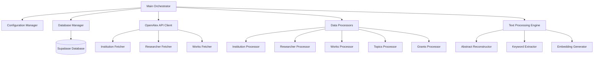
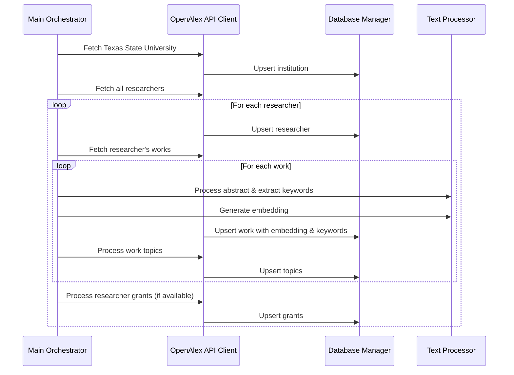

# Design Document

## Overview

This system implements a comprehensive data pipeline that fetches Texas State University researcher data from the OpenAlex API and populates a Supabase database with structured research information. The pipeline processes institutions, researchers, publications, topics, and grants data while generating vector embeddings and extracting keywords for enhanced search capabilities.

## Architecture

### High-Level Architecture



### Processing Flow



## Components and Interfaces

### 1. Configuration Manager

**Purpose:** Centralized configuration management using environment variables.

**Interface:**
```python
class ConfigManager:
    def __init__(self):
        self.database_url: str
        self.email: str  # For OpenAlex polite pool
        self.batch_size: int = 100
        self.rate_limit_delay: float = 0.1
        self.max_retries: int = 3
        
    def get_database_config(self) -> dict
    def get_api_config(self) -> dict
```

### 2. Database Manager

**Purpose:** Handles all database operations with connection pooling and error handling.

**Interface:**
```python
class DatabaseManager:
    def __init__(self, config: ConfigManager)
    def connect(self) -> None
    def upsert_institution(self, data: dict) -> str
    def upsert_researcher(self, data: dict) -> str
    def upsert_work(self, data: dict) -> str
    def upsert_topics(self, work_id: str, topics: list) -> None
    def upsert_grants(self, researcher_id: str, grants: list) -> None
    def close(self) -> None
```

### 3. OpenAlex API Client

**Purpose:** Handles all API interactions with rate limiting, retry logic, and pagination.

**Interface:**
```python
class OpenAlexClient:
    def __init__(self, config: ConfigManager)
    def search_institution(self, name: str) -> dict
    def get_researchers_by_institution(self, institution_id: str) -> Iterator[dict]
    def get_works_by_author(self, author_id: str) -> Iterator[dict]
    def _make_request(self, url: str, params: dict) -> dict
    def _handle_rate_limit(self) -> None
```

### 4. Text Processing Engine

**Purpose:** Handles abstract reconstruction, keyword extraction, and embedding generation.

**Interface:**
```python
class TextProcessor:
    def __init__(self, model_name: str = "all-MiniLM-L6-v2")
    def reconstruct_abstract(self, inverted_index: dict) -> str
    def create_proxy_abstract(self, topics: list) -> str
    def extract_keywords(self, text: str, max_keywords: int = 20) -> list
    def generate_embedding(self, text: str) -> list
```

### 5. Data Processors

**Purpose:** Specialized processors for each data type with validation and transformation.

**Interface:**
```python
class InstitutionProcessor:
    def process(self, raw_data: dict) -> dict

class ResearcherProcessor:
    def process(self, raw_data: dict, institution_id: str) -> dict

class WorkProcessor:
    def process(self, raw_data: dict, researcher_id: str, text_processor: TextProcessor) -> dict

class TopicsProcessor:
    def process(self, raw_topics: list, work_id: str) -> list

class GrantsProcessor:
    def process(self, raw_grants: list, researcher_id: str) -> list
```

## Data Models

### Database Schema

```sql
-- institutions table
CREATE TABLE institutions (
    id UUID PRIMARY KEY DEFAULT gen_random_uuid(),
    openalex_id TEXT UNIQUE NOT NULL,
    name TEXT NOT NULL,
    created_at TIMESTAMPTZ DEFAULT now()
);

-- researchers table
CREATE TABLE researchers (
    id UUID PRIMARY KEY DEFAULT gen_random_uuid(),
    institution_id UUID REFERENCES institutions(id),
    openalex_id TEXT UNIQUE NOT NULL,
    full_name TEXT NOT NULL,
    h_index INT4,
    department TEXT,
    created_at TIMESTAMPTZ DEFAULT now()
);

-- works table (updated with keywords field)
CREATE TABLE works (
    id UUID PRIMARY KEY DEFAULT gen_random_uuid(),
    researcher_id UUID REFERENCES researchers(id),
    openalex_id TEXT UNIQUE NOT NULL,
    title TEXT NOT NULL,
    abstract TEXT,
    keywords TEXT, -- JSON array or comma-separated keywords
    publication_year INT4,
    doi TEXT,
    citations INT4,
    embedding VECTOR(384),
    created_at TIMESTAMPTZ DEFAULT now()
);

-- topics table
CREATE TABLE topics (
    id UUID PRIMARY KEY DEFAULT gen_random_uuid(),
    work_id UUID REFERENCES works(id),
    name TEXT NOT NULL,
    type TEXT NOT NULL,
    score FLOAT8,
    created_at TIMESTAMPTZ DEFAULT now()
);

-- researcher_grants table
CREATE TABLE researcher_grants (
    id UUID PRIMARY KEY DEFAULT gen_random_uuid(),
    researcher_id UUID REFERENCES researchers(id),
    award_id TEXT NOT NULL,
    award_year INT4,
    role TEXT,
    award_amount INT8,
    award_title TEXT,
    created_at TIMESTAMPTZ DEFAULT now()
);
```

### Data Transformation Pipeline

1. **Institution Data:**
   - Extract: `id`, `display_name` from OpenAlex
   - Transform: Map to database schema
   - Load: Upsert to institutions table

2. **Researcher Data:**
   - Extract: `id`, `display_name`, `summary_stats.h_index`, `affiliations`
   - Transform: Parse department from affiliations, handle missing data
   - Load: Upsert to researchers table

3. **Works Data:**
   - Extract: `id`, `title`, `abstract_inverted_index`, `publication_year`, `doi`, `cited_by_count`, `topics`
   - Transform: 
     - Reconstruct abstract if missing
     - Extract keywords from abstract
     - Generate 384-dim embedding
   - Load: Upsert to works table

4. **Topics Data:**
   - Extract: `topics` array from works
   - Transform: Filter for primary topics, extract name, type, score
   - Load: Bulk insert to topics table

## Error Handling

### Retry Strategy

```python
@retry(
    stop=stop_after_attempt(3),
    wait=wait_exponential(multiplier=1, min=4, max=10),
    retry=retry_if_exception_type((requests.RequestException, ConnectionError))
)
def api_call_with_retry(self, url: str, params: dict) -> dict:
    # Implementation with exponential backoff
```

### Error Categories

1. **API Errors:**
   - Rate limiting: Implement exponential backoff
   - Network timeouts: Retry with increasing delays
   - Invalid responses: Log and skip problematic records

2. **Database Errors:**
   - Connection failures: Reconnect and retry
   - Constraint violations: Log and continue
   - Data type errors: Validate and sanitize input

3. **Data Processing Errors:**
   - Missing abstracts: Use reconstruction or proxy generation
   - Malformed JSON: Skip and log problematic records
   - Embedding failures: Log error and store work without embedding

### Logging Strategy

```python
import logging

# Configure structured logging
logging.basicConfig(
    level=logging.INFO,
    format='%(asctime)s - %(name)s - %(levelname)s - %(message)s',
    handlers=[
        logging.FileHandler('database_pipeline.log'),
        logging.StreamHandler()
    ]
)

# Log categories:
# - INFO: Progress updates, successful operations
# - WARNING: Data quality issues, fallback operations
# - ERROR: Failed operations, exceptions
# - DEBUG: Detailed processing information
```

## Testing Strategy

### Unit Tests

1. **API Client Tests:**
   - Mock OpenAlex API responses
   - Test pagination handling
   - Test rate limiting behavior
   - Test error handling and retries

2. **Data Processor Tests:**
   - Test data transformation logic
   - Test edge cases (missing data, malformed input)
   - Test validation rules

3. **Text Processing Tests:**
   - Test abstract reconstruction from inverted index
   - Test keyword extraction accuracy
   - Test embedding generation consistency

### Integration Tests

1. **Database Integration:**
   - Test database connection and operations
   - Test upsert logic with existing data
   - Test foreign key relationships

2. **End-to-End Tests:**
   - Test complete pipeline with sample data
   - Test error recovery scenarios
   - Test performance with large datasets

### Test Data Management

```python
# Use pytest fixtures for test data
@pytest.fixture
def sample_institution_data():
    return {
        "id": "https://openalex.org/I12345",
        "display_name": "Texas State University",
        "ror": "https://ror.org/02hpadn98"
    }

@pytest.fixture
def sample_work_data():
    return {
        "id": "https://openalex.org/W12345",
        "title": "Sample Research Paper",
        "abstract_inverted_index": {"sample": [0], "abstract": [1]},
        "topics": [{"display_name": "Computer Science", "score": 0.95}]
    }
```

## Performance Considerations

### Optimization Strategies

1. **Batch Processing:**
   - Process researchers in batches of 100
   - Bulk insert operations where possible
   - Use connection pooling for database operations

2. **Memory Management:**
   - Stream large datasets instead of loading into memory
   - Clear processed data from memory regularly
   - Use generators for API pagination

3. **Caching:**
   - Cache institution and researcher lookups
   - Cache embedding model to avoid reloading
   - Cache processed abstracts to avoid recomputation

### Monitoring and Metrics

```python
class PipelineMetrics:
    def __init__(self):
        self.institutions_processed = 0
        self.researchers_processed = 0
        self.works_processed = 0
        self.topics_processed = 0
        self.grants_processed = 0
        self.errors_encountered = 0
        self.start_time = time.time()
    
    def get_summary(self) -> dict:
        return {
            "total_runtime": time.time() - self.start_time,
            "records_processed": {
                "institutions": self.institutions_processed,
                "researchers": self.researchers_processed,
                "works": self.works_processed,
                "topics": self.topics_processed,
                "grants": self.grants_processed
            },
            "error_rate": self.errors_encountered / max(1, self.works_processed)
        }
```